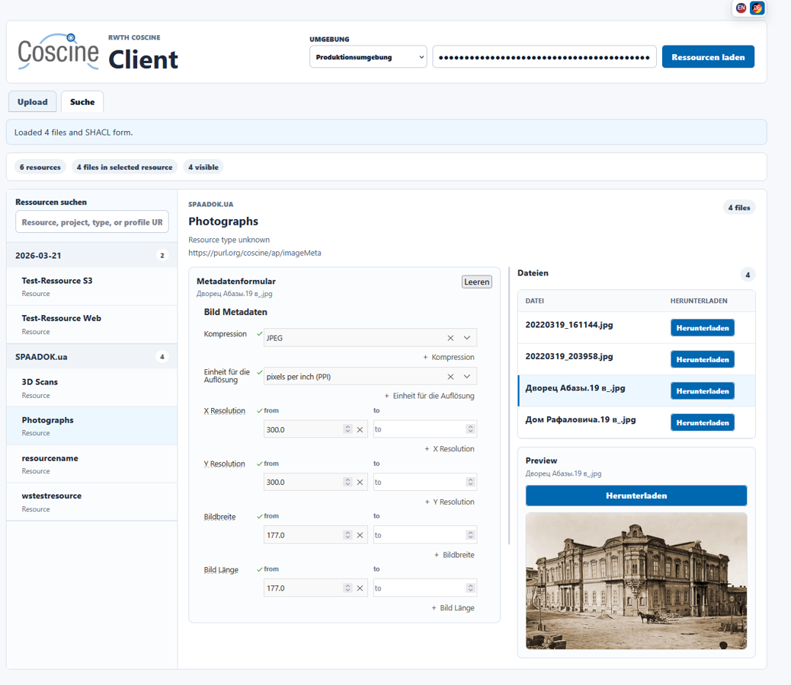
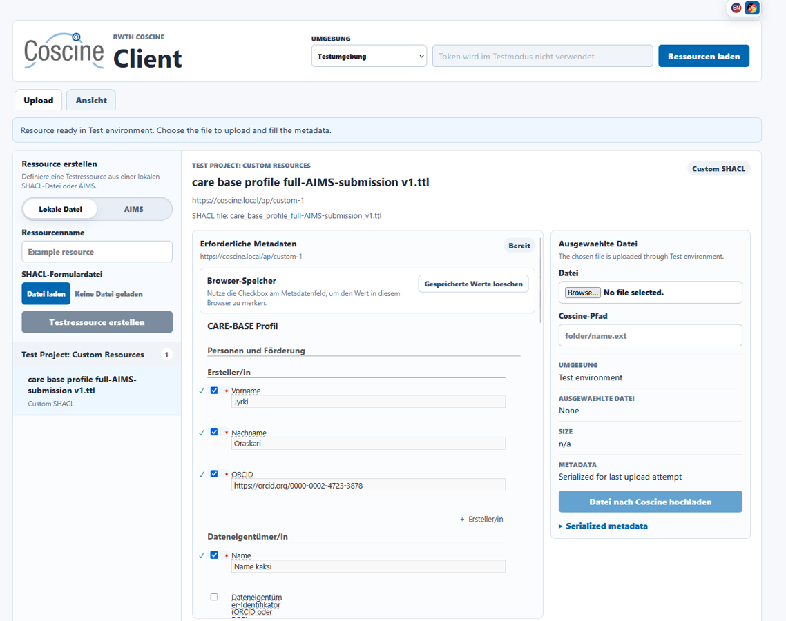

# Coscine Client

Coscine Client is a browser-based React application for working with RWTH Coscine resources. It helps users load Coscine projects, select resources, fill SHACL-based metadata forms, upload files with metadata, inspect uploaded content, and test workflows locally before using a production Coscine token.





## What It Does

- Connects to the production Coscine API through a local proxy.
- Loads projects, resources, files, and application profiles available to a Coscine API token.
- Renders SHACL metadata forms with `@ulb-darmstadt/shacl-form`.
- Serializes completed metadata as Turtle before upload.
- Uploads file content and metadata to a selected Coscine path.
- Provides a search and preview view for resource files.
- Supports English and German interface text.
- Includes a test environment for local workflows without contacting Coscine.
- Lets users create test resources from a local SHACL file or from AIMS metadata profiles.
- Can remember selected metadata field values in browser storage.

## Screens

### Production Resource View

The production workflow loads resources from Coscine, displays files in the selected resource, renders the resource metadata form, and previews downloadable files where possible.

### Test Upload View

The test environment runs in the browser with local test resources and in-memory uploads. It is useful for checking SHACL forms, upload paths, metadata serialization, and form-memory behavior without sending data to Coscine.

## Requirements

- Node.js 20 or newer.
- npm.
- A Coscine API token for production usage.

The test environment does not require an API token.

## Installation

```bash
npm install
```

## Development

Start the Vite development server:

```bash
npm run dev
```

The application is served at:

```text
http://127.0.0.1:5173
```

During development, Vite proxies Coscine API requests through:

```text
/coscine-api
```

This keeps browser CORS handling out of the frontend code.

## Production Build

Build the static frontend:

```bash
npm run build
```

Serve the built app with the included Node.js server:

```bash
npm run serve
```

The server listens on:

```text
http://127.0.0.1:4173
```

Set `PORT` to use a different port:

```bash
PORT=8080 npm run serve
```

## Basic Workflow

1. Open Coscine Client in a browser.
2. Choose `Production environment` or `Test environment`.
3. For production, enter a Coscine API token and load resources.
4. Select a resource.
5. Choose or create the metadata profile/resource needed for the upload.
6. Load a local file and set the Coscine target path.
7. Fill the required metadata form.
8. Upload the file and serialized metadata.

API tokens are entered in the browser and sent as `Authorization` headers only to proxied Coscine API requests. Do not commit tokens or store them in source files.

## Test Environment

The test environment is built for local experimentation. It provides sample projects, resources, application profiles, SHACL form loading, metadata serialization, file upload handling, and a local resource view. Test uploads are kept in browser memory for the current session.

In test mode, users can create resources from:

- A local SHACL form file.
- A metadata profile selected through AIMS search.

## Scripts

- `npm run dev` starts the Vite development server.
- `npm run build` creates the production build in `dist/`.
- `npm run preview` previews the Vite build locally.
- `npm run serve` serves `dist/` with the included Node.js server and Coscine proxy.

## Project Structure

```text
.
├── index.html
├── Picture1.png
├── Picture2.png
├── server.js
├── src
│   ├── aimsApi.js
│   ├── assets
│   │   ├── aims_title_FHD_transparent_header.png
│   │   └── coscine_rgb.svg
│   ├── coscineApi.js
│   ├── main.jsx
│   └── styles.css
└── vite.config.js
```

## Technology

- React 19.
- Vite 6.
- N3 for Turtle parsing and serialization.
- `@ulb-darmstadt/shacl-form` for SHACL form rendering.
- A small Node.js server for serving production builds and proxying Coscine API requests.

## License

This project is licensed under the MIT License. See [LICENSE](LICENSE).
